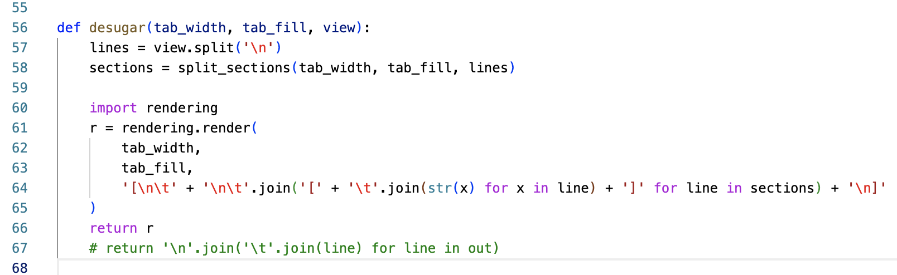

# Úvod a shrnutí
Vývoj byl dělen do celkem jasně vymezených fází, které jsou popsány dále. Tyto fáze jsou uspořádány jak logicky, tak chronologicky. Nešlo o extrémně náročný, avšak ani triviální projekt. Několik výstupů, kterých bylo dosaženo spolu s dokončením implementace, je:

1. Technické zadání projektu nebylo jednoznačné, zejména co se týče zpětného převodu úprav View na Model.
2. Implementace obsahuje prostor pro zlepšení *(viz [Technical description and analysis (cz).md](docs/Technical%20description%20and%20analysis%20(cz).md))*.
3. Neformálně řečeno, úspěšné dokončení implementace pomocí skládání heuristik je velmi uspokojivé. Samozřejmě oproti formálnímu algoritmu zde vyvstává nutnost ladění v případě nedostatečné správnosti. Potom je třeba heuristiky přidávat, potažmo zkoumat jejich interakce a upravovat je.

# Fáze vývoje
## Návrh IO
Rozhraní Columnatoru je velmi jednoduché - dva vstupně-výstupní soubory - s malou možností konfigurace.

Omezení týkající se uzpůsobení jsou:

- Jako výplň tabulátoru lze použít pouze jediný znak.
- Columnator neumí ignorovat zarovnávání v předdefinovaných syntaktických kontextech *(např. v řetězcích či komentářích)*. Za tímto účelem je potřeba použít Columnator spolu s dalším nástrojem, který se o alternativní syntaktické kontexty stará.

## Implementace IO
Obsaženo v souboru `fileworks.py`. Kvůli jednoduchosti implementace i následného užívání bylo zvoleno hromadné *(a ne diffové)* upravování Modelu i View.

## Přenos Model > View
Obsaženo v souboru `rendering.py`. Zde se nevyskytly žádné větší potíže. Pomocí rozepisu implementace z iterativní do rekurzivní podoby byla odladěna chyba v přenosu zarovnání sloupců mezi sekcemi *(v iterativní implementaci se zarovnání přenášelo i mezi nesouvisejícími sekcemi)*.

## Přenos View > Model
Obsaženo v souboru `viewing.py`. Zde se vývoj značně zpomalil, neboť zadání projektu nebylo dost specifické a problém měl mnoho mezních případů. Nakonec byla zvolena implementace pomocí heuristik *(à la "Jaké parciální podmínky by rozhodně řešení mělo splňovat?")*, která se ukázala jako schůdná.

V této fázi vývoje bylo ve velké míře využíváno již implementované vykreslování Modelu, viz screenshot:

Složitost implementace View > Model oproti Model > View tkvěla v tom, že zde začal hrát roli nelokální stav. Zatímco Model > View lze implementovat rekurzivně rozdělením na nezávislé podproblémy, View > Model nejenže obsahuje podproblémy vzájemně závislé, ba dokonce není a priori jasné, kde jsou "hranice" oněch podproblémů *(dlouhá posloupnost mezer může a nemusí reprezentovat odsazení)*.

Tuto zkušenost lze *(pouze napůl žertovně)* označit za jeden z nejlepších argumentů proti používání mezer pro zarovnání - udržování zarovnání pomocí neatomických objektů *(posloupností znaků)* nejenže je těžký problém na provedení, ba v základu obsahuje sémantické nejasnosti.
